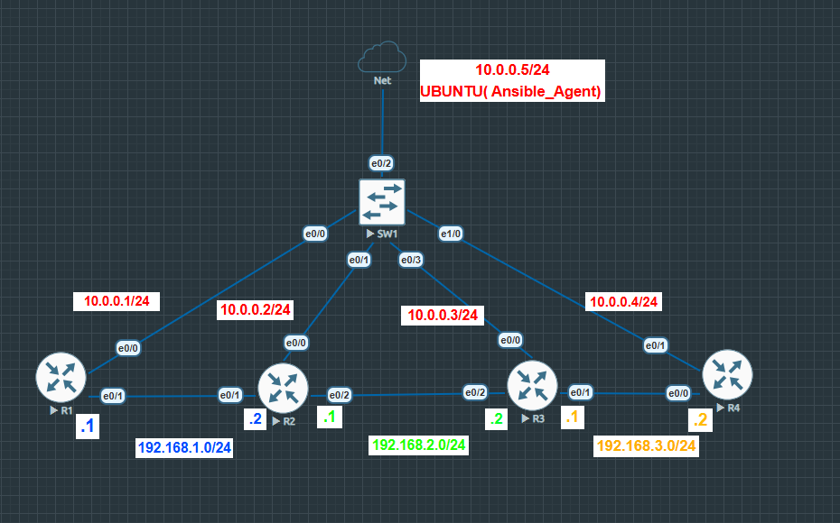
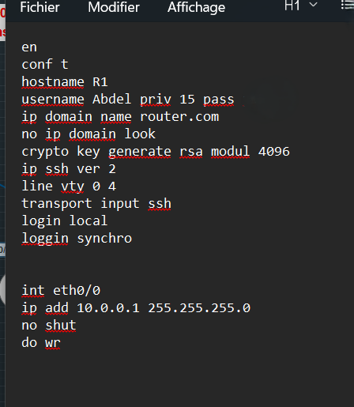
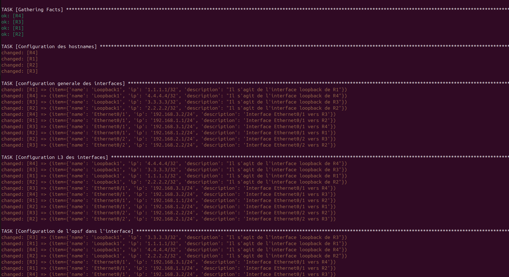
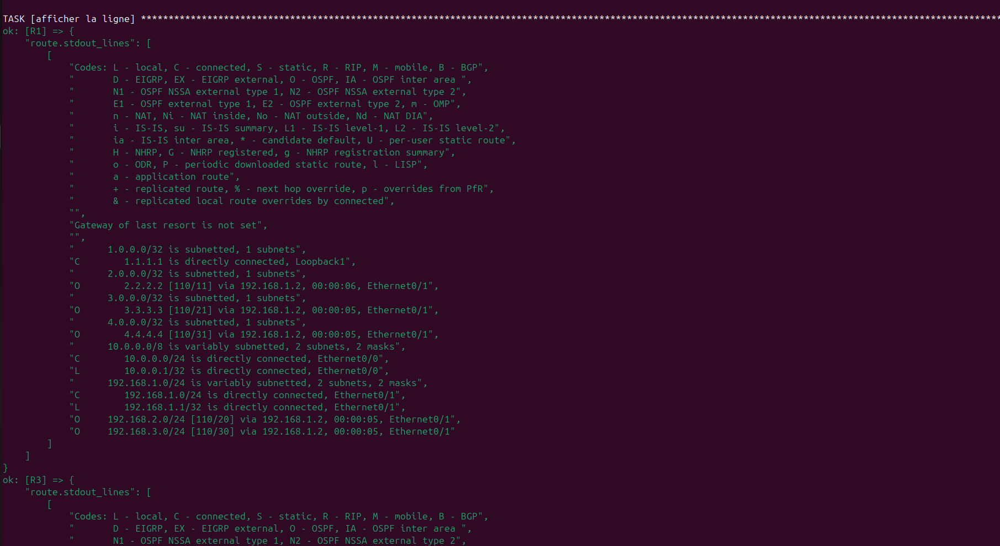

# 🔧 Automatisation Ansible – Configuration réseau basique de routeurs Cisco IOS

## 🎯 Objectif du projet

> **Appliquer à petite échelle Ansible pour la configuration réseau.**

Ce projet est un petit labo réaliser dans le but d'automatiser, avec **Ansible** et la collection **`cisco.ios`**, la configuration de 4 routeurs Cisco IOS (hostname, interfaces, adressage IP et routage dynamique **OSPF**), pour éviter de le faire manuellement en CLI sur chaque équipement.

---

## 🗺️ Topologie du réseau



Le réseau repose sur deux plans distincts :

- **Un plan de "management"** (`10.0.0.0/24`), construit autour du switch **SW1**. Chaque routeur (R1, R2, R3, R4) y possède une interface `Ethernet0/0` avec une adresse fixe (`10.0.0.1` à `10.0.0.4`). C'est ce réseau que la machine **Ubuntu** (`10.0.0.5/24`, poste de contrôle Ansible) utilise pour joindre les routeurs en SSH. Il n'est **pas** annoncé dans OSPF : il sert uniquement à l'administration, pas au transit de trafic.
- **Un plan de "données"**, en chaîne point-à-point entre les routeurs :
  - **R1 ↔ R2** sur `192.168.1.0/24`
  - **R2 ↔ R3** sur `192.168.2.0/24`
  - **R3 ↔ R4** sur `192.168.3.0/24`

R2 et R3 sont donc les routeurs "du milieu" : ils ont chacun deux interfaces de transit (vers leurs voisins de chaîne) en plus de leur interface de management. R1 et R4 sont aux extrémités de la chaîne, avec une seule interface de transit chacun.

### Liaisons entre routeurs

| Liaison | Réseau | Interface / IP côté A | Interface / IP côté B |
|---|---|---|---|
| R1 ↔ R2 | 192.168.1.0/24 | R1 – Ethernet0/1 – .1 | R2 – Ethernet0/1 – .2 |
| R2 ↔ R3 | 192.168.2.0/24 | R2 – Ethernet0/2 – .1 | R3 – Ethernet0/2 – .2 |
| R3 ↔ R4 | 192.168.3.0/24 | R3 – Ethernet0/1 – .1 | R4 – Ethernet0/1 – .2 |
| R1 ↔ SW1 | 10.0.0.0/24 | R1 – Ethernet0/0 – 10.0.0.1 | SW1 – e0/0 |
| R2 ↔ SW1 | 10.0.0.0/24 | R2 – Ethernet0/0 – 10.0.0.2 | SW1 – e0/1 |
| R3 ↔ SW1 | 10.0.0.0/24 | R3 – Ethernet0/0 – 10.0.0.3 | SW1 – e0/3 |
| R4 ↔ SW1 | 10.0.0.0/24 | R4 – Ethernet0/0 – 10.0.0.4 | SW1 – e1/0 |
| Ubuntu ↔ SW1 | 10.0.0.0/24 | Ubuntu – 10.0.0.5 | SW1 – e0/2 |

Chaque routeur porte aussi une interface **Loopback1** (identifiant unique / router-id) : `1.1.1.1` (R1), `2.2.2.2` (R2), `3.3.3.3` (R3), `4.4.4.4` (R4).

> ⚠️ Les interfaces `Ethernet0/0` (management, `10.0.0.0/24`) sont configurées **manuellement** sur les routeurs, en amont — c'est ce qui permet à Ansible de s'y connecter en SSH avant même de lancer le playbook. 



Tout le reste (hostname, interfaces de transit, adressage, OSPF) est appliqué par Ansible.

---

## ⚙️ Ce que fait le playbook (`playbook.yaml`)

1. **Hostname** — applique le nom de chaque routeur (`cisco.ios.ios_hostname`)
2. **Interfaces** — active les interfaces de transit et la loopback, avec description (`cisco.ios.ios_interfaces`)
3. **Adressage L3** — applique l'IP de chaque interface (`cisco.ios.ios_l3_interfaces`)
4. **OSPF par interface** — active OSPF (process 1, area 1) en réseau point-to-point sur les interfaces de transit et la loopback (`cisco.ios.ios_ospf_interfaces`)
5. **OSPF process** — définit le router-id (basé sur la Loopback1) et passe la Loopback1 en interface passive, pour qu'elle soit annoncée sans chercher de voisin dessus (`cisco.ios.ios_ospfv2`)
6. **Vérification** — récupère la table de routage (`show ip route`) de chaque routeur et l'affiche (`cisco.ios.ios_command` + `debug`)

---

## 🗂️ Structure du dépôt

```
.
├── ansible.cfg          # Configuration Ansible (host_key_checking, deprecation_warning)
├── inventory.yaml       # Inventaire des routeurs (groupe "routers")
├── playbook.yaml        # Playbook principal
├── group_vars/
│   └── routers.yaml     # Variables communes : connexion, credentials, OSPF process/area
├── host_vars/
│   ├── R1.yaml
│   ├── R2.yaml
│   ├── R3.yml
│   └── R4.yml
├── topologie.png        # Schéma du réseau
├── resultat1.png        # Extrait d'exécution du playbook
└── resultat2.png        # Table de routage obtenue (show ip route)
```

---

## 🔑 Pré-requis

- Ansible installé
- Collection Cisco installée :
  ```bash
  ansible-galaxy collection install cisco.ios
  ```
- Interfaces `Ethernet0/0` de R1 à R4 déjà configurées en `10.0.0.0/24` (accès SSH)
- Routeurs joignables depuis le poste de contrôle Ansible (10.0.0.5)

## ▶️ Utilisation

```bash
ansible-playbook -i inventory.yaml playbook.yaml
```

---

## ✅ Résultats

Exécution du playbook : hostnames, interfaces, adressage et OSPF appliqués avec succès sur les 4 routeurs.



Vérification via `show ip route` sur R1 : les réseaux distants (loopbacks de R2/R3/R4, et les sous-réseaux 192.168.2.0/24 et 192.168.3.0/24) sont bien appris par OSPF (marqués `O`) via R2, confirmant que la chaîne R1–R2–R3–R4 est correctement routée de bout en bout.



---

## 📝 Remarques

- OSPF tourne en un seul process (id `1`) et une seule area (`1`) sur l'ensemble du réseau.
- Le réseau de management `10.0.0.0/24` n'est volontairement pas intégré à OSPF : il reste isolé du plan de données.
- Chaque Loopback1 est passive en OSPF : elle est annoncée mais n'établit pas d'adjacence.

